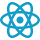

<h1 align="left">Hi 👋, I'm Ali</h1>
<h3 align="left">A passionate Frontend developer</h3>

 

<h2 align="left">💫 About Me:</h2>

-  🔭 I’m currently working on **Self grow**

-  🌱 I’m currently learning **NextJS**

-  👯 I’m looking to collaborate on **Front-end**

-  💬 Ask me about **Web and Front-end**

-  📫 How to reach me **Shariatian92@gmail.com**
  
-  👉 My Website [Shariatian.ir](https://shariatian.ir)

 

<h2 align="left">🌐 Socials:</h2>

 

<h2 align="left">💻 Skills:</h2>

